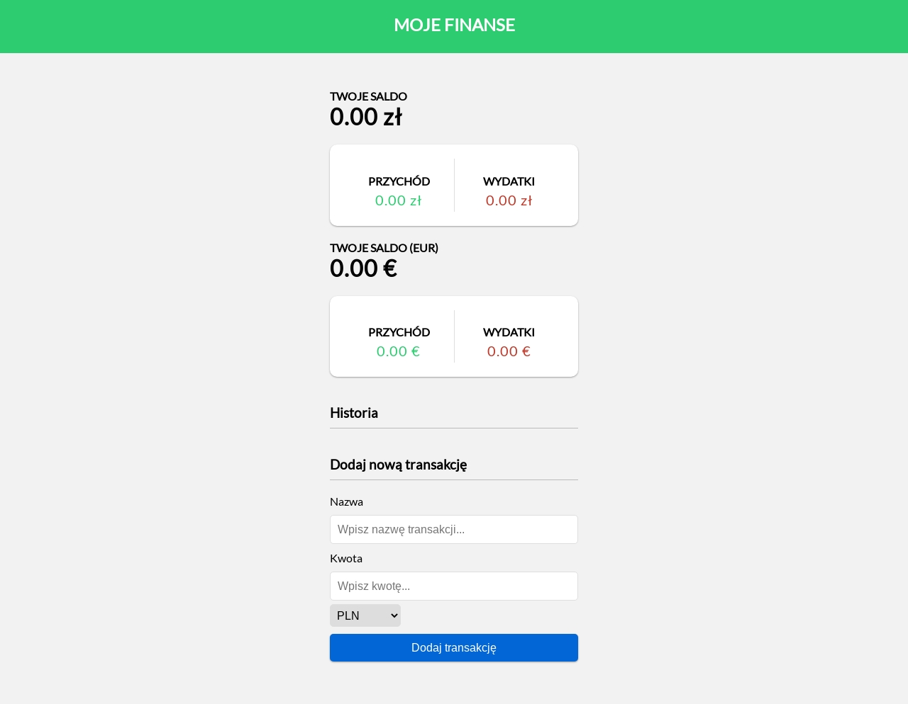
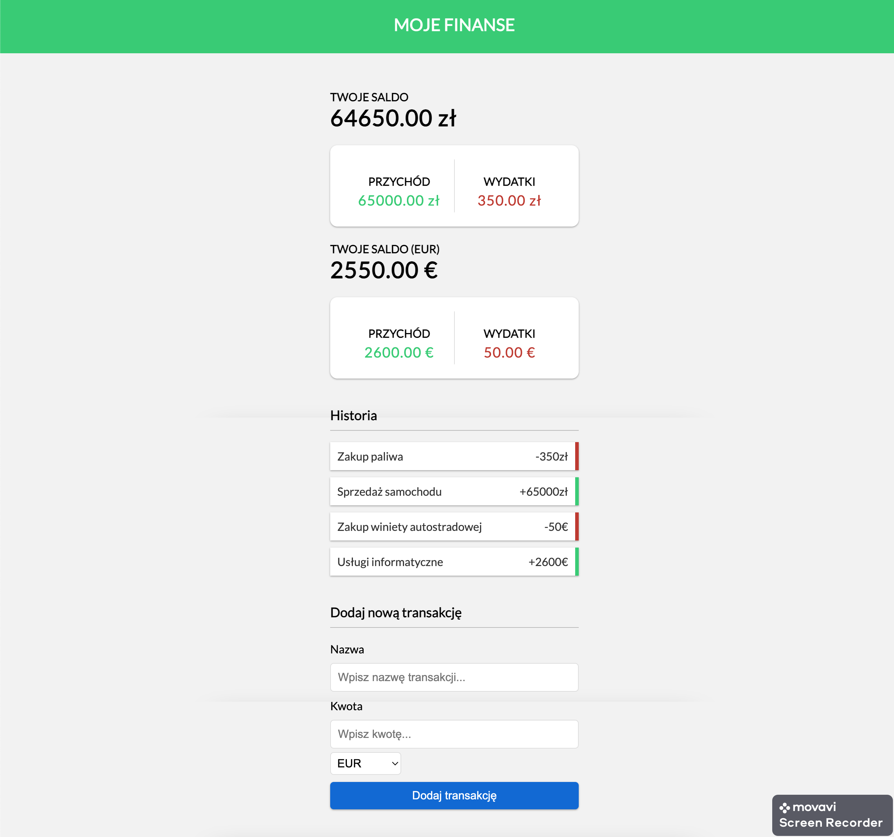

# FinanSync
> The FinanSync application is a web application that allows the user to track their income and expenses in two currencies (PLN and EUR).

#### Live demo [_here_](http://finansync.pl/).

## Technologies Used
- HTML & CSS
- JavaScript

## Features
- Users can enter a total budget amount and save it for tracking their expenses
- Users can add expenses, and the application calculates the total expenditure and remaining balance
- The application displays a list of expenses, including the product name and amount. Users can delete items from the list

## Screenshots

